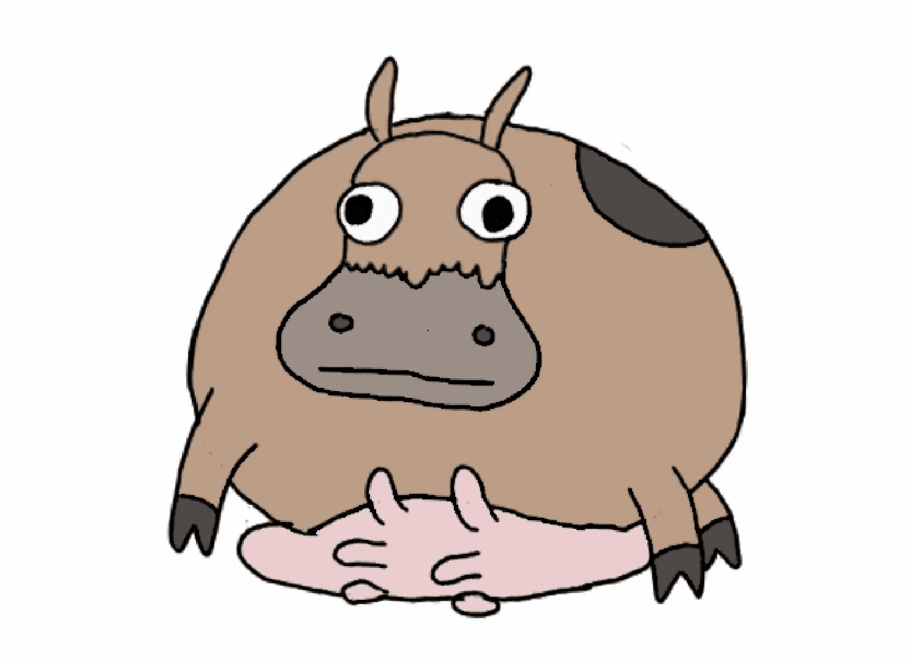

## Simple server handling requests to a cowsay service that repeats your input with a little flair

Clone down then run in terminal:
```
npm i
```
To run tests and lint files in terminal type:
```
gulp
```
To start server in terminal:
```
node server.js
```

To request a list of all cow models
```
curl -X GET localhost:8000/api/cowsay/list
```

To request a cowsay in terminal type:
```
curl -X GET localhost:8000/api/cowsay?text=exapletext&type=exampletype
```
